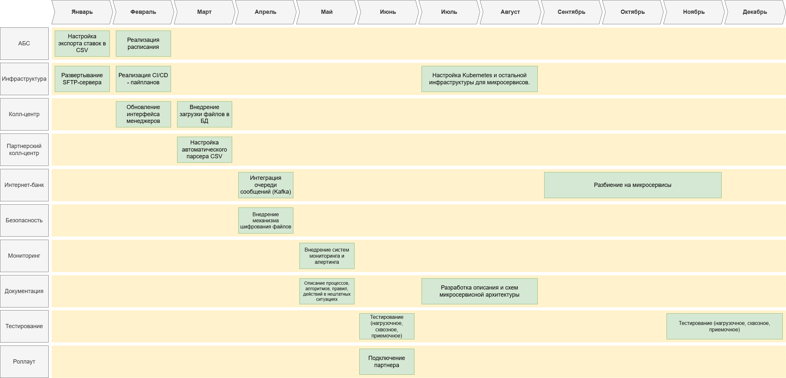

### **Название задачи:** 
### **Автор:** Михайленко Андрей
### **Дата:** 23.12.2025
### **Функциональные требования**
Опишите здесь верхнеуровневые Use Cases. Их нужно оформить в виде таблицы с пошаговым описанием:

| **№** | **Действующие лица или системы** | **Use Case**                  | **Описание**                                                               |
|:-----:|:-----------------------|:-----------------------------------------------------------------------------------------------------------|
|   1   | Менеджер кол-центра    | Получение актуальных ставок   | Кол-центр загружает файл с ставками через SFTP раз в 1 час.                |
|   2   | Партнёрский кол-центр  | Загрузка ставок из файла      | Внешняя система получает файл по SFTP и обновляет локальную БД.            |
|   3   | АБС                    | Экспорт ставок в файл         | АБС генерирует файл rates.csv каждые 30 минут и выгружает на SFTP-сервер.  |
|   4   | Клиент                 | Консультация по ставкам       | Клиент звонит в кол-центр, менеджер просматривает ставки из локальной БД.  |

### **Нефункциональные требования**
Опишите здесь нефункциональные требования и архитектурно значимые требования.

| **№** | **Требование**                                                 |
|:-----:|:---------------------------------------------------------------|
|   1   | Ставки должны обновляться не реже чем раз в 1 час.             |
|   2   | SFTP-сервер должен быть доступен 99.9% времени.                |
|   3   | Шифрование файлов при передаче (PGP или AES).                  |
|   4   | Поддержка формата CSV (для совместимости с партнёром).         |
|   5   | Логирование ошибок передачи файлов (срок хранения — 30 дней).  |

### **Решение**
Приведите диаграммы контекста и контейнеров в модели C4. Опишите там основные компоненты и интеграции всех элементов решения. 

[Container.puml](Container.puml)

[Context.puml](Context.puml)

### **Альтернативы**

|       **Вариант**        | **Достоинства**                     | **Недостатки**                                                |
|:------------------------:|:------------------------------------|:--------------------------------------------------------------|
| REST API для кол-центра  | Реальное время обновления ставок.   | Партнёр не поддерживает API. Риск перегрузки АБС.	         |
|     Брокер сообщений 	   | Асинхронно (надежно)                | Сложность реализации 	                                     |
|        Общая БД	       | Нет задержек.                       | Нарушает изоляцию систем. Небезопасно для внешнего партнёра.	 |
|     Email-рассылка 	   | Простота.                           | Нет шифрования, риск потери писем. 	                         |

**Недостатки, ограничения, риски**

Подробно опишите здесь недостатки, ограничения и риски выбранного решения.
1. Технические ограничения

| **Категория**       | **Проблема**                      | **Риск**                                                         |
|:--------------------|:----------------------------------|:-----------------------------------------------------------------|
| Актуальность данных | Задержка обновления ставок        | Ставки в кол-центре могут устаревать на 1 час                    |
| Безопасность        | Перехват данных при передаче      | Возможность компрометации финансовой информации                  |
| Надёжность          | Сбой SFTP-сервера                 | Прекращение процесса обмена ставками между системами             |
| Совместимость       | Разные форматы данных у партнёров | Ошибки при обработке ставок партнёрскими системами               |
| Производительность  | Ручная обработка файлов           | Задержки в обновлении данных при увеличении количества продуктов |
| Аудит               | Отсутствие логов операций         | Невозможность отследить проблемы при передаче данных             |

**Road map**

[RoadMap.drawio](RoadMap.drawio)

